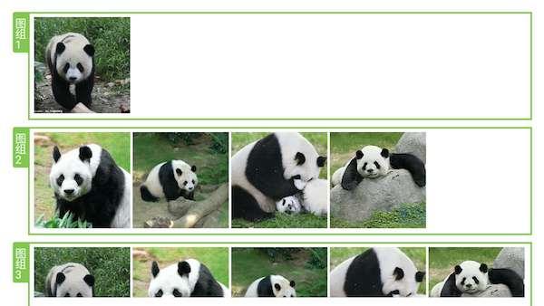

# LeftSectionRecyclerView

[](https://jitpack.io/#lx2308/LeftSectionRecyclerView)

使用RecyclerView 分组展示图片



## 使用

```
    allprojects {
        repositories {
            ...
            maven { url "https://jitpack.io" }
        }
    }
    
      dependencies {
           compile 'com.github.lx2308:LeftSectionRecyclerView:$version'
    }
```
